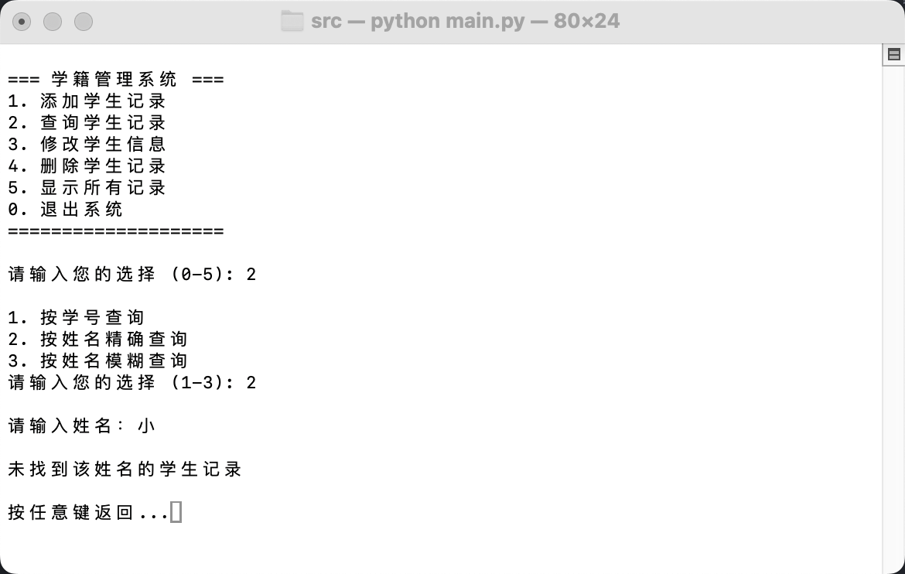
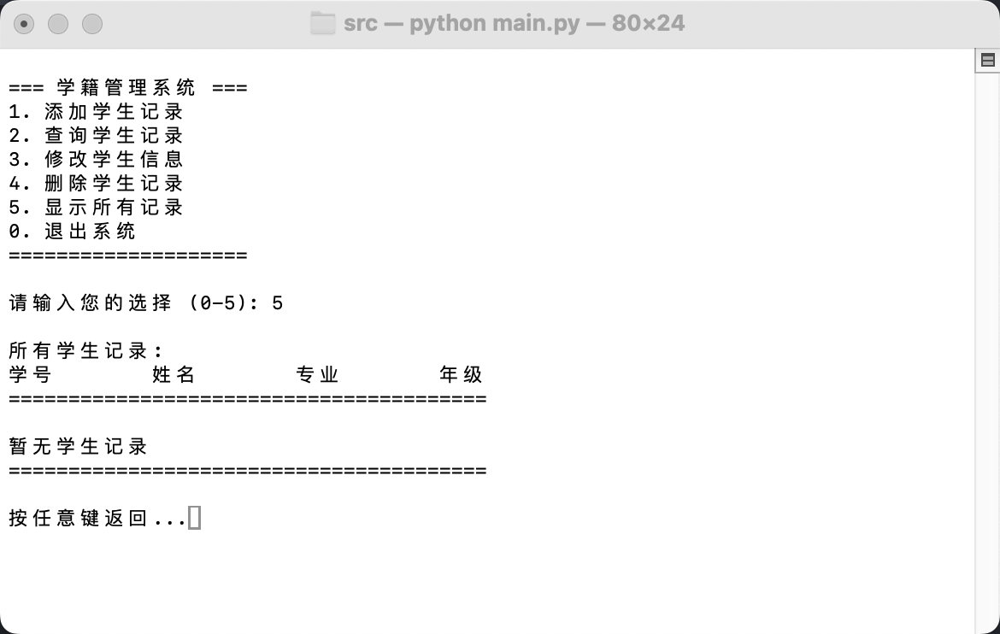
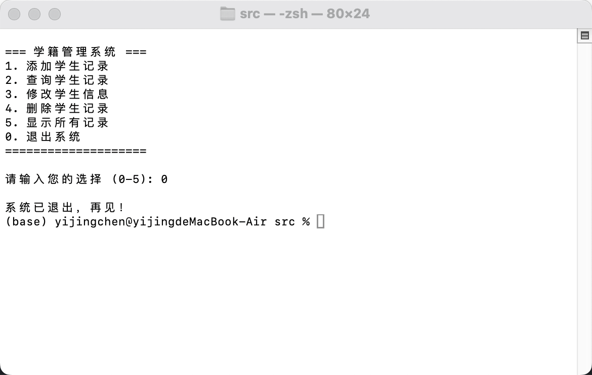

# 数据库引论第一次作业实验报告

## 基本信息
- 实验：上机作业1——基于文件系统的简单学籍管理程序
- 姓名：陈一璟
- 学号：24300120183

## 一、实验目的
1. 理解数据持久化：掌握如何将数据永久存储到磁盘文件中
2. 体验文件系统的局限性：通过手动实现数据的增删改查，体会直接使用文件系统管理数据时面临的数据冗余、数据不一致性、以及应用程序对数据结构的强依赖性等问题
3. 编程实践：提高使用Python语言解决实际问题的能力，为后续学习SQL和数据库设计打下基础

## 二、运行环境
- 操作系统：MacOS 15.3
- 编程语言：Python 3.9.6
- 运行方式：在`src/`目录下执行`python main.py`

## 三、程序设计与实现思路

### 1. 项目结构
```
homework_1/
├── src/
│   ├── main.py             # 主程序入口
│   ├── student_manager.py  # 核心业务逻辑（增删改查）
│   ├── utils.py            # 工具函数
│   └── constants.py        # 常量定义
├── data/
│   └── students.txt        # 学生记录数据文件
└── report.pdf              # 实验报告
```

### 2. 数据结构设计
- 单条学生记录：`student = [id, name, major, grade]`，使用列表存储
- 学生记录列表：`students = []`，存储所有学生记录
- 字段分隔符：逗号`,`
- 字段索引定义在`constants.py`中：
```python
DELIMITER = ','           # 字段分隔符
DATA_FILE = '../data/students.txt'  # 数据文件路径
ID_INDEX = 0              # 学号字段索引
NAME_INDEX = 1            # 姓名字段索引
MAJOR_INDEX = 2           # 专业字段索引
GRADE_INDEX = 3           # 年级字段索引
```

### 3. 核心功能实现

**1. 添加学生记录**
- 输入学号、姓名、专业、年级
- 数据合法性检查：学号非空且为数字、学号唯一性、姓名非空、专业非空、年级为4位数字
- 将新记录追加到学生列表并保存到文件

**2. 查询学生记录**
- 按学号查询：精确匹配学号，如输入的学号存在，则显示该学生详细信息；否则提示未找到。
- 按姓名精确查询：精确匹配姓名，且显示所有同名学生信息。
- 按姓名模糊查询：模糊匹配姓名，显示所有姓名中包含输入字符串的学生信息。

**3. 修改学生信息**
- 输入学号查找学生，如找到记录则显示该学生信息；
- 允许修改其专业、年级（输入为空则不修改），并显示修改后的学生信息。
- 修改原理：读取文件 → 修改内存中的记录 → 重写文件

**4. 删除学生记录**
- 输入学号查找学生，如找到记录则打印学生信息并确认是否删除。
- 删除原理：创建临时文件 → 拷贝除待删除记录外的数据 → 用临时文件覆盖原文件

**5. 显示所有记录**
- 以表格形式打印所有学生记录
- 若文件为空则提示"暂无学生记录"

### 4. 文件操作实现
- 数据加载：[load_students()](file:///Users/yijingchen/Documents/FDU-2026spring/dev/database-2026spring/homework_1/src/utils.py#L26-35)函数逐行读取文件，解析为列表
- 数据保存：[save_students()](file:///Users/yijingchen/Documents/FDU-2026spring/dev/database-2026spring/homework_1/src/utils.py#L38-42)函数将列表格式化后写入文件
- 异常处理：文件不存在时返回空列表


## 四、程序运行截图

1. **初始菜单界面**


2. **添加学生记录**
- 如果学号不存在，则添加成功。

- 如果学号已存在，则提示添加失败。


3. **查询学生记录**
- 按学号查询： 
- 按姓名精确查询，如果找到记录，显示所有同名学生信息；否则提示未找到： 
- 按姓名模糊查询：

4. **修改学生信息**
- 输入学号，如果找到记录，显示该学生信息并允许修改专业或年级（输入为空则不修改）。


5. **删除学生记录**
- 输入学号，如果找到记录，删除该学生记录并显示删除成功。


6. **显示所有记录**
- 以表格形式打印当前所有学生记录（如果文件为空，则提示"暂无学生记录"）。



7. **退出程序**
- 确认退出后，程序结束。



## 五、思考题

### 1. 数据结构变更的影响

**问题**：当修改了程序中的结构体定义（例如增加一个"班级"字段）后，原有的students.txt文件还能直接使用吗？如果不修改程序，会有什么后果？这说明了文件系统的什么问题？

**回答**：

原有students.txt文件不能直接使用。原因如下：

- 原有数据格式：`学号,姓名,专业,年级`（4个字段）
- 新增字段后格式：`学号,姓名,专业,年级,班级`（5个字段）

**不修改程序的后果**：
- 程序尝试访问新增的`CLASS_INDEX`时会发生索引越界错误
- 无法正确读取和处理原有学生记录，可能导致程序崩溃或数据丢失
- 数据和程序逻辑紧密耦合，数据结构变更需要同步修改代码

**说明了文件系统的局限性**：
- 缺乏数据结构的约束和验证机制，无法自动处理数据结构变更
- 没有数据迁移机制，无法平滑处理数据结构的演进
- 数据和应用程序强耦合，缺乏独立性
- 没有提供数据完整性检查，容易导致数据访问错误

### 2. 并发操作的问题

**问题**：如果两个用户同时操作这个程序（例如一个在查询，一个在修改），可能会发生什么问题？

**回答**：

可能发生以下问题：

1. **数据不一致**：用户A查询时看到的是修改前的数据，而用户B同时修改了数据，导致A看到过时信息。

2. **文件读写冲突**：一个用户正在读取文件，另一个用户正在写入文件，可能导致读取不完整或写入失败，甚至损坏文件。

3. **数据覆盖**：两个用户同时修改同一学生记录，后保存的修改会覆盖先保存的修改，导致数据丢失。

4. **临时文件冲突**：两个用户同时执行删除操作，可能导致临时文件被覆盖或删除，影响操作正确性。

5. **资源竞争**：多个用户同时访问文件系统资源，可能导致程序运行缓慢或死锁。

**说明文件系统的局限性**：
- 缺乏并发控制机制，无法协调多个用户的同时操作
- 没有事务支持，无法保证操作的原子性和一致性
- 缺乏锁机制，无法防止数据的并发修改
- 没有提供隔离级别，无法确保用户看到的数据是一致的

## 六、备注

**大模型使用情况**
- 编写代码前，使用大模型生成项目架构建议，明确项目目录结构，熟悉Python程序架构模式；
- 使用大模型梳理边界情况（格式、权限、文件不存在等），并在代码中添加相应的错误提示；
- 文件读写操作代码参数较复杂，向大模型描述需求后确认了代码参数使用正确；
- 报告写作中，使用大模型总结了两段"文件系统的局限性"，并在思考题部分摘录学习。