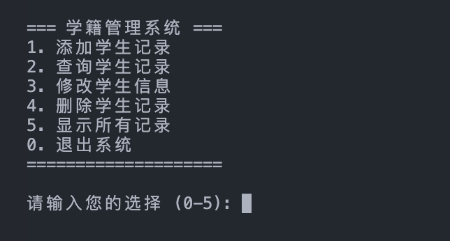
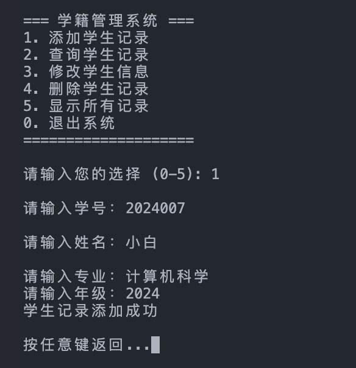
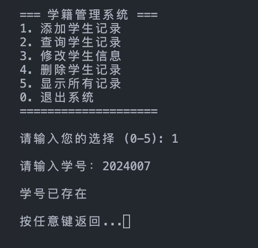
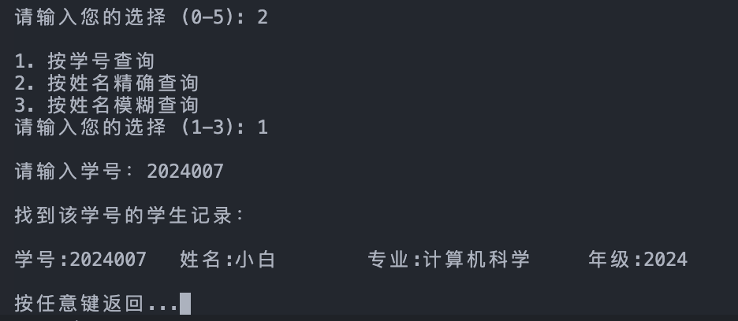
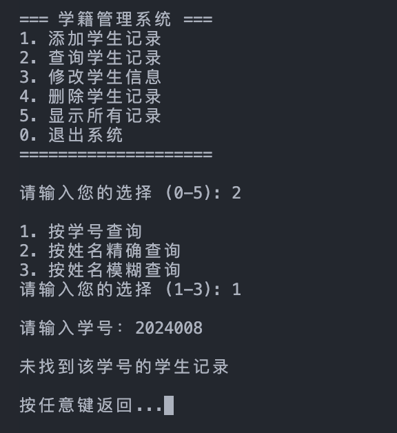
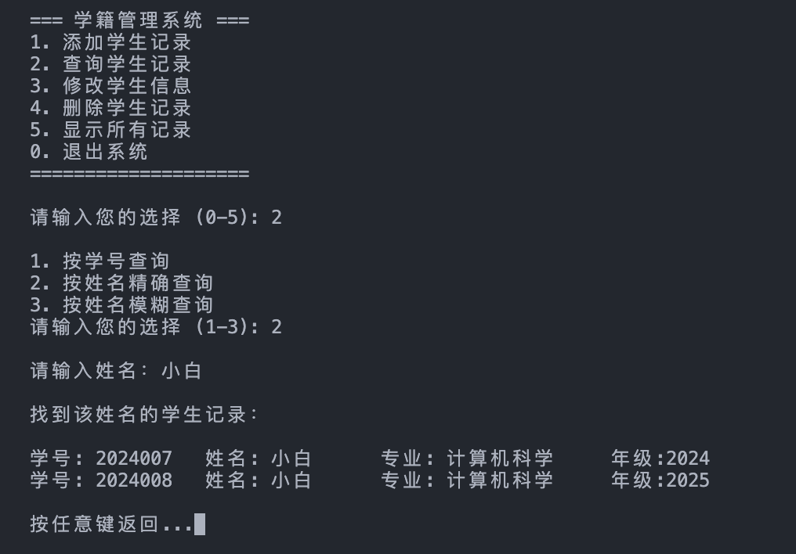
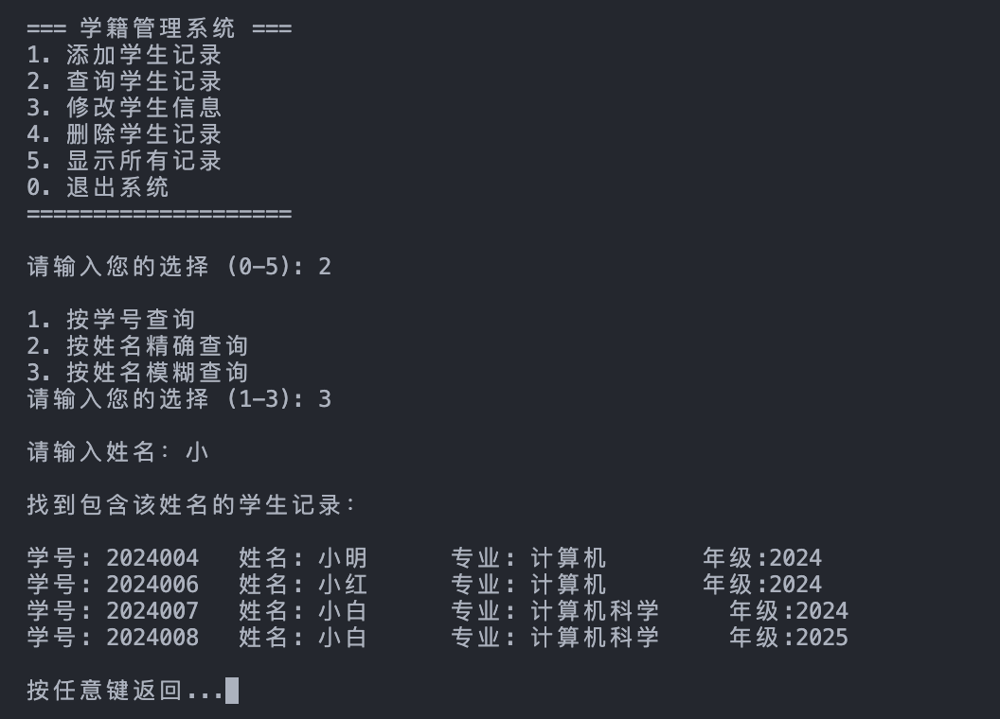
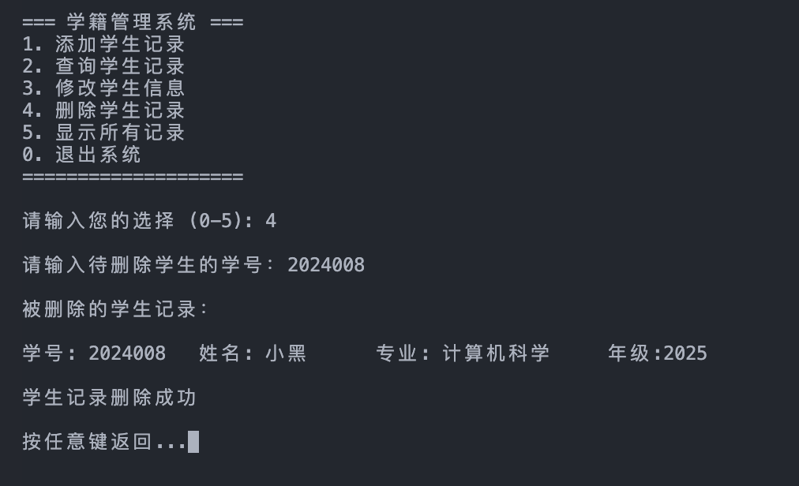
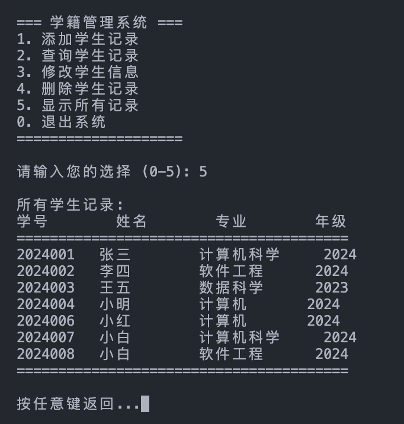

# 数据库引论实验报告

## 基本信息
- 实验：上机作业1——基于文件系统的简单学籍管理程序
- 姓名：陈一璟
- 学号：24300120183

## 一、实验目的与操作说明
### 1. 实验目的
1. 使用Python编写一个基于文件系统的学生学籍管理程序
2. 理解文件系统在数据库管理中的作用，体会直接操作文件系统的优势和局限性
3. 掌握Python文件操作相关知识，包括文件读写、异常处理等，为后续学习SQL和数据库操作奠定基础

### 2. 操作说明
1. 环境：
    - 操作系统：MacOS 15.3
    - 编程语言：Python 3.9.6
2. 运行程序：
    - 打开终端，导航到`homework1/src/`目录
    - 运行`python main.py`  
    ```bash
    cd src/
    python main.py
    ```

## 二、程序设计与实现思路

### 1. 项目架构

```
homework1/
├── src/
│   ├── main.py             # 主程序入口
│   ├── student_manager.py  # 核心业务逻辑（增删改查）
│   ├── utils.py            # 工具函数
│   └── constants.py        # 常量（文件路径、分隔符、索引定义）
├── data/
│   └── students.txt        # 学生记录数据文件
└── report.pdf              # 实验报告
```

### 2. 核心流程
1. 程序启动，显示菜单
2. 用户选择操作，根据选择调用对应功能
3. 循环菜单，直到用户退出

### 3. 功能实现细节

1. **基本数据结构与文件操作**
- 单条学生记录：`student = [id, name, major, grade]`，其中索引在`constants.py`中定义，此外分隔符也在`constants.py`中定义：
```py
    # 字段分隔符
    DELIMITER = ','

    # 学生记录字段索引
    ID_INDEX = 0
    NAME_INDEX = 1
    MAJOR_INDEX = 2
    GRADE_INDEX = 3
```
- 学生记录列表：`students = []`，并从`students.txt`文件中读取记录，每条记录为一个字符串，用分隔符分割字段，使用`load_students()`函数加载。文件路径在`constants.py`中定义。

2. **新增学生记录**
    - 提示用户输入：学号、姓名、专业、年级
    - 检查输入是否合法（不为空、格式正确）
    - 将新的学生记录写入列表末尾，记录写入`students.txt`

3. **查询学生记录**
    - 选择查询方式（学号查询或姓名查询）
    - 按学号查询：输入学号，检查学号合法性（非空、格式正确），若合法则显示该学生的详细信息
    - 按姓名查询：输入姓名，显示所有同名学生的信息（模糊匹配：包含该输入的所有记录；精确匹配：仅显示完全匹配的记录），未找到则提示用户未找到

4. **修改学生记录**
    - 输入待修改学生的学号，若学生存在，允许修改其专业或年级，并对输入作合法性检查，允许不修改（即输入为空时不修改该字段）
    - 修改原理：读取文件 → 修改对应记录列表中的字段 → 重写文件
    - 此外，记录该学生修改前后的信息并打印，以明确告知用户修改了哪些字段

5. **删除学生记录**
    - 输入待删除学生的学号，如果找到该记录，将其删除
    - 删除原理：创建临时文件 → 拷贝除待删除记录外的数据 → 用临时文件覆盖原文件
    - 此外，记录该学生信息并打印，以明确告知用户删除了哪条记录


## 三、程序运行截图

1. **初始界面**
- 显示一个菜单，用户可以选择不同的操作：    


2. **新增学生记录**
- 提示用户依次输入：学号、姓名、专业、年级。    

- 如果学号已经存在，提示用户学号已存在。    


3. **查询学生记录**
- 按学号查询：输入学号，找到时显示该学生的详细信息，否则提示未找到。    


- 按姓名精确查询：输入姓名，找到时显示所有同名学生的详细信息，否则提示未找到。  

- 按姓名模糊查询：输入姓名，找到时显示所有姓名中包含该输入的学生详细信息，否则提示未找到。  


4. **修改学生信息**
- 输入待修改学生的学号。如果该学生存在，允许用户修改其专业或年级，并显示修改前后的学生信息。    


5. **删除学生记录**
- 输入待删除学生的学号，如果学生存在，找到该记录并删除。
- 删除成功后，提示用户已删除该学生记录，并显示被删除的学生信息。    


6. **显示所有记录**
- 以表格形式清晰打印当前文件中的所有学生记录，若文件为空则提示“暂无学生记录”。  


## 四、思考题

1. **修改程序数据结构定义**
- 本项目的数据结构使用Python列表，单条学生记录`student`包含学号、姓名、专业、年级；每个学生记录作为一个列表元素，学生记录被存储在一个`students`列表中。
- 假设增加一个班级字段，并定义相应的索引：
```py
    # 学生记录字段索引
    ID_INDEX = 0
    NAME_INDEX = 1
    MAJOR_INDEX = 2
    GRADE_INDEX = 3
    CLASS_INDEX = 4     # 新增：班级字段索引
```
- 这时，原有的 students.txt 文件不能直接使用。
    **原因分析**：
    - 原有的 students.txt 文件中，每个学生记录的格式为：`学号,姓名,专业,年级`，只有4个字段
    - 新增班级字段后，程序期望每个学生记录包含5个字段：`学号,姓名,专业,年级,班级`
    - 当程序尝试访问新增的`CLASS_INDEX`时，会发生索引越界错误，因为原有文件只有4个元素（索引0-3）
    
    **不修改程序的后果**：
    - 程序运行时会出现索引越界异常，导致程序崩溃
    - 无法正确读取和处理原有的学生记录，可能导致数据丢失或程序无法正常运行
    
    **文件系统的局限性**：
    - 文件系统缺乏数据结构的约束和验证机制，无法自动处理数据结构的变更
    - 数据和程序逻辑紧密耦合，当数据结构变更时需要同时修改程序代码
    - 缺乏数据迁移机制，无法平滑地处理数据结构的演进
    - 没有提供数据完整性检查，容易导致数据访问错误

2. **并发操作**

如果两个用户同时操作这个程序（例如一个在查询，一个在修改），可能会发生以下问题：

**1. 数据不一致问题**
- **场景**：用户A正在查询学生信息，同时用户B修改了该学生的信息
- **问题**：用户A可能会看到过时的信息，因为查询操作是基于修改前的数据

**2. 文件读写冲突**
- **场景**：用户A正在读取文件，同时用户B正在写入文件
- **问题**：可能导致文件读取不完整或写入失败，甚至损坏文件

**3. 数据覆盖问题**
- **场景**：两个用户同时修改同一个学生的信息
- **问题**：后保存的修改会覆盖先保存的修改，导致其中一个用户的修改丢失

**4. 临时文件冲突**
- **场景**：两个用户同时执行删除操作
- **问题**：可能会导致临时文件被覆盖或删除，影响删除操作的正确性

**5. 资源竞争**
- **场景**：多个用户同时访问文件系统资源
- **问题**：可能导致程序运行缓慢，甚至出现死锁

**文件系统的局限性**：
- 文件系统缺乏并发控制机制，无法协调多个用户的同时操作
- 没有事务支持，无法保证操作的原子性和一致性
- 缺乏锁机制，无法防止数据的并发修改
- 没有提供隔离级别，无法确保用户看到的数据是一致的

## 五、备注

### 1. 大模型使用情况
- 编写代码前，使用大模型生成项目架构建议，并生成架构图。此前我较少使用python构建完整项目，通过这一举措，我能够明确本项目的目录结构，熟悉python下的文件架构模式。
- 使用了大模型梳理边界情况（格式、权限、文件不存在等），并在代码中添加了相应的错误提示。
- 文件读写操作的相关代码参数较复杂，我向大模型描述需求后确认了代码参数使用正确。
- 报告写作中，使用大模型总结了两段“文件系统的局限性”，并在思考题部分摘录学习。