# 数据库引论第二次作业实验报告

## 基本信息

- 实验：上机作业2——数据库设计与SQL实践
- 姓名：陈一璟
- 学号：24300120183

## 一、场景概述与表结构说明

### 业务场景概述

本数据库设计模拟了一个大学课程管理系统，涵盖**教师管理**、**学生管理**、**课程管理**和**选课管理**四大核心业务模块。系统支持以下业务操作：

- 管理教师信息（姓名、所属院系）
- 管理学生信息（姓名、专业）
- 管理课程信息（课程名称、授课教师、学分）
- 记录学生选课情况及成绩

数据库设计包含多种边界情况用于SQL练习：

- 存在未开课的教师（Frank、Karen）
- 存在未选课的学生（Sophia、Evelyn）
- 存在不及格成绩（John、Elijah）
- 存在跨专业选课情况

### 数据库表结构

#### 1. teachers（教师表）

| 字段名        | 类型     | 约束          | 说明     |
|:---------- |:------ |:----------- |:------ |
| id         | SERIAL | PRIMARY KEY | 教师唯一标识 |
| name       | TEXT   | NOT NULL    | 教师姓名   |
| department | TEXT   | -           | 所属院系   |

#### 2. students（学生表）

| 字段名   | 类型     | 约束          | 说明     |
|:----- |:------ |:----------- |:------ |
| id    | SERIAL | PRIMARY KEY | 学生唯一标识 |
| name  | TEXT   | NOT NULL    | 学生姓名   |
| major | TEXT   | -           | 所学专业   |

#### 3. courses（课程表）

| 字段名         | 类型     | 约束          | 说明                  |
|:----------- |:------ |:----------- |:------------------- |
| id          | SERIAL | PRIMARY KEY | 课程唯一标识              |
| course_name | TEXT   | NOT NULL    | 课程名称                |
| teacher_id  | INT    | FOREIGN KEY | 授课教师ID（关联teachers表） |
| credits     | INT    | -           | 课程学分       |

#### 4. enrollments（选课记录表）

| 字段名        | 类型     | 约束          | 说明                |
|:---------- |:------ |:----------- |:----------------- |
| id         | SERIAL | PRIMARY KEY | 选课记录唯一标识          |
| student_id | INT    | FOREIGN KEY | 学生ID（关联students表） |
| course_id  | INT    | FOREIGN KEY | 课程ID（关联courses表）  |
| grade      | INT    | -           | 课程成绩（0-100分）      |

### E-R图

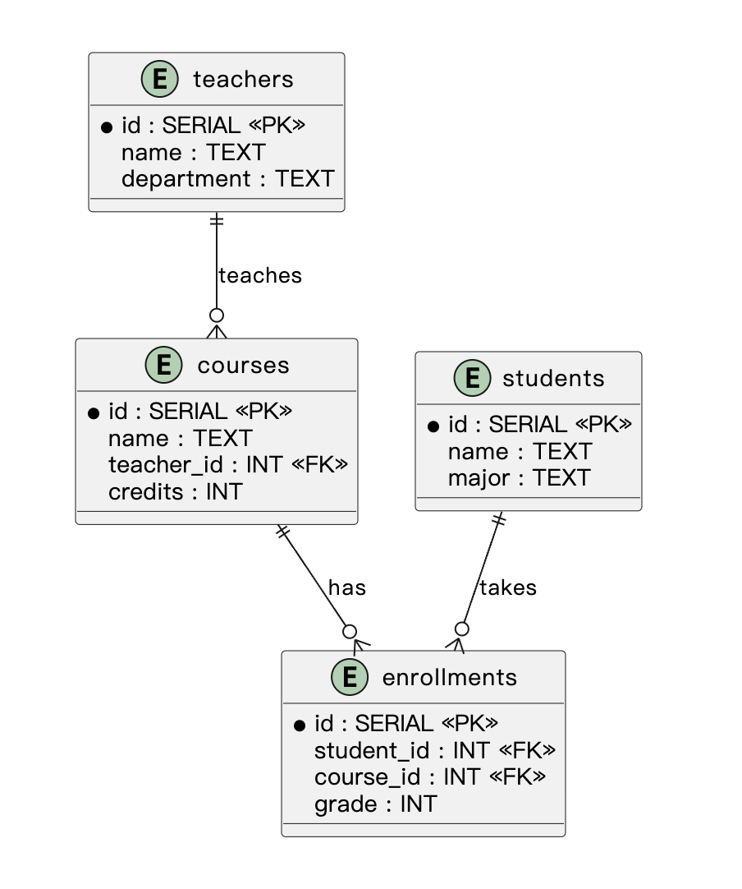

**关系说明**：

- 教师与课程：一对多关系（1位教师可教授多门课程）
- 学生与选课记录：一对多关系（1名学生可选多门课程）
- 课程与选课记录：一对多关系（1门课程可有多名学生选修）

## 二、问答记录（共10题）

**code review原则**：

* 使用统一命名规范：表名建议复数，字段名使用小写下划线风格（如 `student_id`）。
* SQL 语句结构清晰：按 `SELECT → FROM → JOIN → WHERE → GROUP BY → HAVING → ORDER BY → LIMIT` 排版。
* 多表查询时使用表别名（如 `students s`），提升可读性。
* 检查 `JOIN` 条件是否正确，避免错误连接或笛卡尔积。
* `UPDATE` / `DELETE` 语句必须包含合理的 `WHERE` 条件，防止误操作全表数据。
* 聚合查询中，非聚合字段必须出现在 `GROUP BY` 中。
* 统计人数时注意重复记录问题，必要时使用 `COUNT(DISTINCT ...)`。
* 条件筛选与分组筛选区分明确：普通条件使用 `WHERE`，聚合结果筛选使用 `HAVING`。
* 判断空值时使用 `IS NULL` / `IS NOT NULL`，不要使用 `= NULL`。
* 查询结果如需展示或比较，建议使用 `ORDER BY` 保证输出顺序稳定，并规定升序或降序。
* 在满足题目要求的前提下，优先选择可读性高、逻辑清晰的写法。
* 执行后核对结果集是否符合题意，关注边界情况（无选课学生、无人选课程、重复数据等）。

### 第1题

【出题人】：陈一璟   【答题人】：佘子曦

【题目描述】：查询所有学生的姓名、专业以及他们所选课程的课程名称和对应的教师姓名，按学生姓名排序。

【考察知识点】：多表连接

【答题人SQL语句】：

```sql
SELECT students.name AS student_name,students.major,
        courses.name AS course_name,teachers.name AS teacher_name
FROM students
JOIN enrollments
    ON enrollments.student_id=students.id
JOIN courses
    ON courses.id=enrollments.course_id
JOIN teachers
    ON courses.teacher_id=teachers.id
ORDER BY students.name ASC;
```

【运行结果截图】：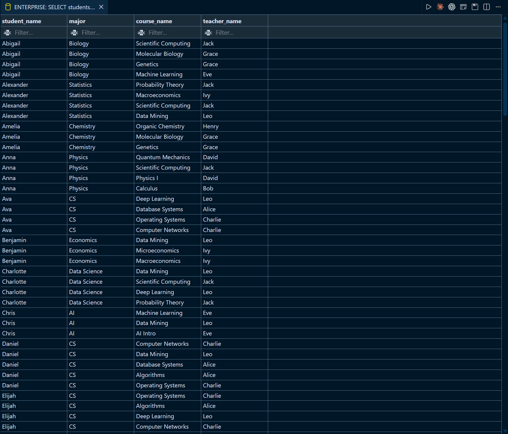

【出题人点评/验收结论】：结果正确，使用了INNER JOIN连接了多个表构造正确路径，查询结果符合题目要求。建议使用表别名，提升可读性。

---

### 第2题

【出题人】：陈一璟   【答题人】：佘子曦

【题目描述】：统计每个专业的学生人数以及他们的平均成绩，只显示平均成绩大于80的专业，平均成绩保留2位小数。

【考察知识点】：分组聚合（GROUP BY + 聚合函数）、HAVING子句、ROUND函数

【答题人SQL语句】：

```sql
SELECT students.major, COUNT(DISTINCT students.id) AS students_number,
    ROUND(AVG(enrollments.grade),2) AS avg_grade
FROM students
JOIN enrollments
    ON enrollments.student_id=students.id
GROUP BY students.major
HAVING AVG(enrollments.grade)>80;
```

【运行结果截图】：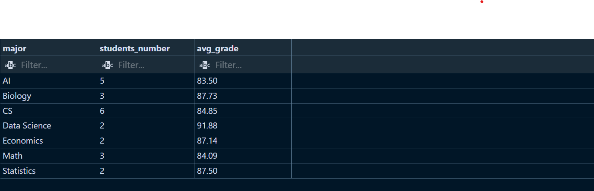

【出题人点评/验收结论】：查询结果正确，能够考虑学生重复选课问题并使用 DISTINCT 去重，体现了较好的数据统计意识。

---

### 第3题

【出题人】：陈一璟   【答题人】：佘子曦

【题目描述】：查询没有选修任何课程的学生姓名和专业。

【考察知识点】：嵌套查询（NOT EXISTS）、子查询

【答题人SQL语句】：

```sql
SELECT students.name,students.major
FROM students
WHERE NOT EXISTS(
    SELECT enrollments.student_id
    FROM enrollments
    WHERE enrollments.student_id=students.id
);
```

【运行结果截图】：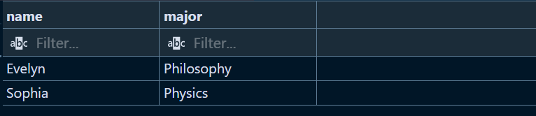

【出题人点评/验收结论】：查询结果正确，能够考虑学生未选课的情况，使用 NOT EXISTS 子查询实现了目标。建议子查询中使用`SELECT 1`更轻量化。

---

### 第4题

【出题人】：陈一璟   【答题人】：佘子曦

【题目描述】：将所有成绩低于60分的学生的成绩提高5分。

【考察知识点】：数据更新（UPDATE）、条件限制

【答题人SQL语句】：

```sql
UPDATE enrollments
SET grade=grade+5
WHERE grade<60;
```

【运行结果截图】：

【出题人点评/验收结论】：WHERE 条件和更新逻辑语句都正确，能够限定低分记录进行批量修改。

---

### 第5题

【出题人】：陈一璟   【答题人】：佘子曦

【题目描述】：查询每个教师所授课程的平均成绩，按平均成绩降序排序，只显示平均成绩前5名的教师信息（包括教师姓名、部门和平均成绩），平均成绩保留2位小数。

【考察知识点】：多表连接、分组聚合、排序（ORDER BY）、限制结果数量（LIMIT）、ROUND函数

【答题人SQL语句】：

```sql
SELECT teachers.name AS teacher_name,teachers.department,
        ROUND(AVG(enrollments.grade),2)AS avg_grade 
FROM teachers
JOIN courses
    ON courses.teacher_id=teachers.id
JOIN enrollments
    ON enrollments.course_id=courses.id
GROUP BY teachers.name,teachers.department
ORDER BY avg_grade DESC
LIMIT 5;
```

【运行结果截图】：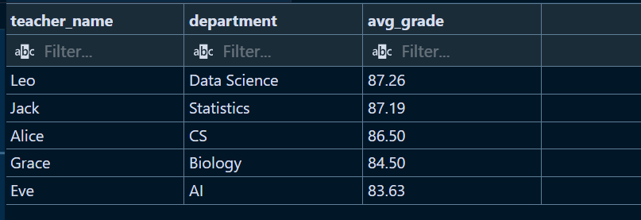

【出题人点评/验收结论】：查询整体正确，能够综合运用连接、聚合、排序与限制结果数量。建议按教师主键分组，可进一步确保结果唯一性与严谨性。

---

### 第6题

【出题人】：佘子曦   【答题人】：陈一璟

【题目描述】：查询所有“跨专业选课”记录，即学生专业与授课教师所属院系不同的选课情况。结果包括学生姓名、学生专业、课程名称、课程学分、授课教师姓名、教师所属院系和成绩，并按课程学分降序、成绩降序排列。

【考察知识点】：多表连接（INNER JOIN）、条件筛选、排序（ORDER BY）

【答题人SQL语句】：

```sql
SELECT
    s.name AS student_name,
    s.major,
    c.name AS course_name,
    t.name AS teacher_name
FROM enrollments e
INNER JOIN students s ON e.student_id = s.id
INNER JOIN courses c ON e.course_id = c.id
INNER JOIN teachers t ON c.teacher_id = t.id
ORDER BY s.name;
```

【运行结果截图】：
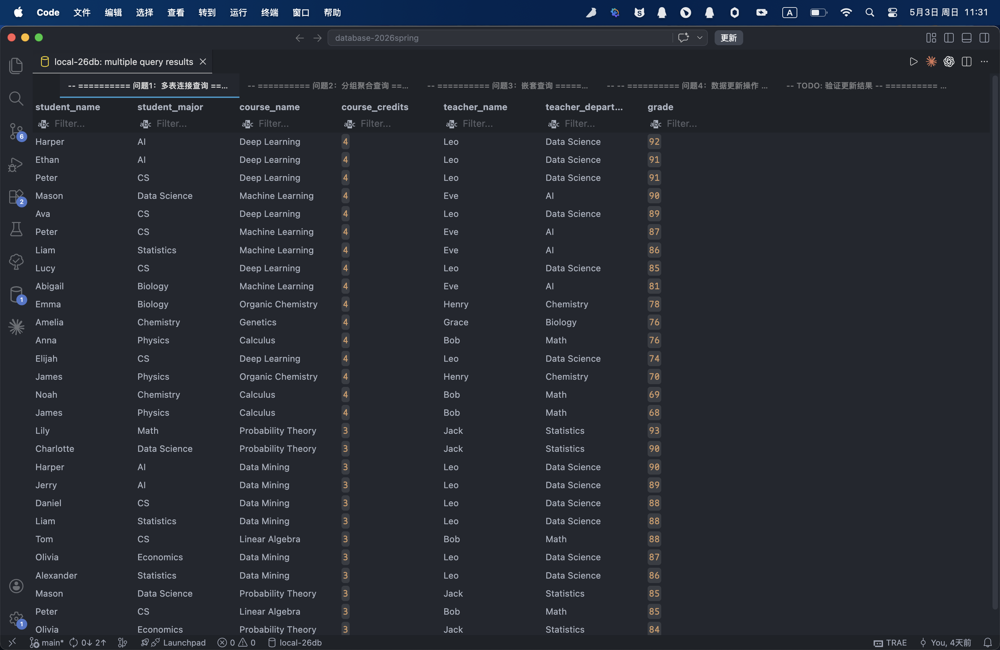
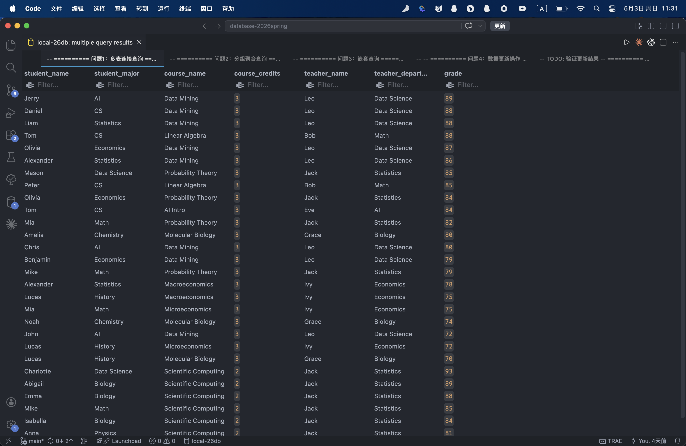

【出题人点评/验收结论】：逻辑正确，排序清晰。若考虑空值场景，可使用`IS DISTINCT FROM`提升健壮性。

---

### 第7题

【出题人】：佘子曦   【答题人】：陈一璟

【题目描述】按课程学分统计选课情况，查询每种学分课程的课程数量、选课总人次、最高成绩、最低成绩和平均成绩，只显示选课总人次不少于10的学分类型。平均数保留两位小数。

【考察知识点】分组聚合（GROUP BY + 聚合函数）、HAVING子句、ROUND函数

【答题人SQL语句】：

```sql
SELECT
    s.major,
    COUNT(DISTINCT s.id) AS student_count,
    ROUND(AVG(e.grade), 2) AS avg_grade
FROM students s
INNER JOIN enrollments e ON s.id = e.student_id
GROUP BY s.major
HAVING AVG(e.grade) > 80;
```

【运行结果截图】：
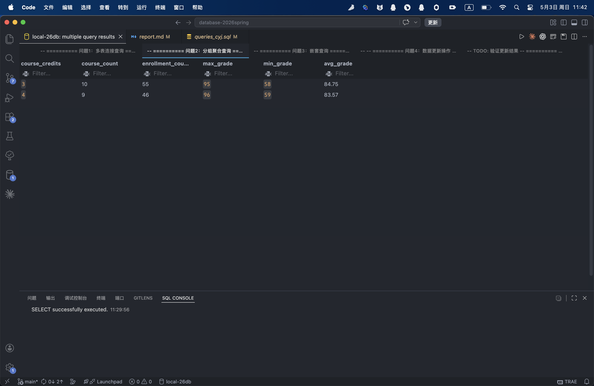

【出题人点评/验收结论】：统计逻辑整体正确，能够区分课程数与选课人次。若希望统计所有课程数量，建议使用`LEFT JOIN`；选课总人次可直接使用`COUNT(*)`简化表达。

---

### 第8题

【出题人】：佘子曦   【答题人】：陈一璟

【题目描述】查询从未被 AI 专业学生选修过的课程名称、学分以及对应授课教师姓名。

【考察知识点】嵌套查询（NOT EXISTS）、子查询

【答题人SQL语句】：

```sql
SELECT
    s.name,
    s.major
FROM students s
WHERE NOT EXISTS (
    SELECT 1
    FROM enrollments e
    WHERE e.student_id = s.id
);
```

【运行结果截图】：
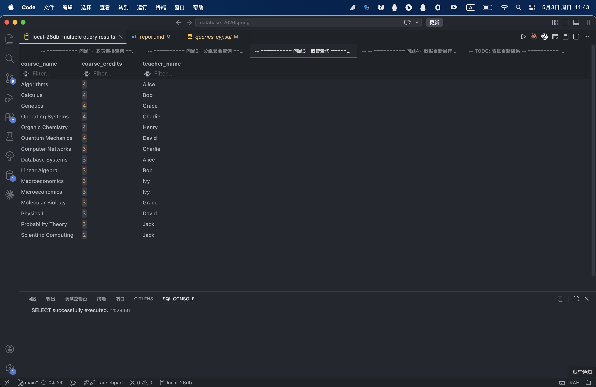

【出题人点评/验收结论】：子查询表达精准，结构清晰，是标准的`NOT EXISTS`解法。

---

### 第9题

【出题人】：佘子曦   【答题人】：陈一璟

【题目描述】将所有 2 学分课程对应的选课成绩增加 3 分，但更新后的成绩不能超过 100 分。

【考察知识点】数据更新（UPDATE）、条件限制、条件表达式

【答题人SQL语句】：

```sql
UPDATE enrollments e
SET grade = LEAST(e.grade + 3, 100)
FROM courses c
WHERE e.course_id = c.id
    AND c.credits = 2;
```

【运行结果截图】：(以Mike和Anna为例，enrollments表中正确更新了成绩。且sql终端中显示数目正确，确有8人选择了这门课程)
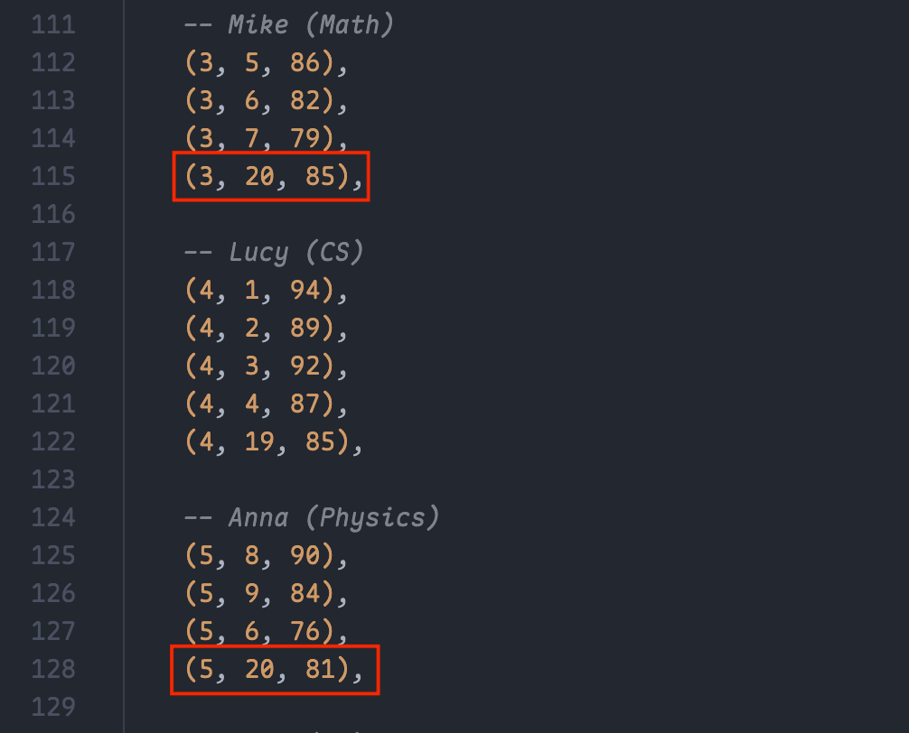
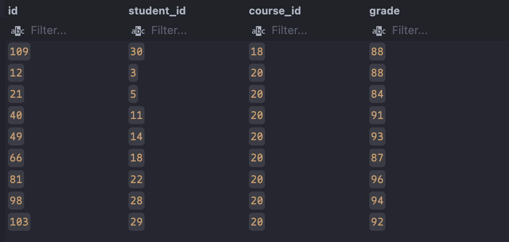


【出题人点评/验收结论】：写法规范，充分利用 PostgreSQL 特性，更新逻辑严谨。  

---

### 第10题

【出题人】：佘子曦   【答题人】：陈一璟

【题目描述】：查询选课人数最多的前 5 门课程，结果包括课程名称、课程学分、授课教师姓名、教师所属院系、选课人数、平均成绩和优秀率。其中优秀率定义为成绩大于等于90分的选课记录占该课程总选课记录的比例。结果按选课人数降序排列，若选课人数相同，则按平均成绩降序排列。

【考察知识点】：多表连接、分组聚合、条件统计、排序（ORDER BY）、限制结果数量（LIMIT）

【答题人SQL语句】：

```sql
SELECT c.name AS course_name,
    c.credits AS course_credits,
    t.name AS teacher_name,
    t.department AS teacher_department,
    COUNT(e.student_id) AS enrollment_count,
    ROUND(AVG(e.grade), 2) AS avg_grade,
    ROUND(
        SUM(
            CASE
                WHEN e.grade >= 90 THEN 1
                ELSE 0
            END
        ) * 100.00 / COUNT(e.student_id),
        2
    ) AS excellent_rate
FROM courses c
INNER JOIN teachers t ON c.teacher_id = t.id
INNER JOIN enrollments e ON c.id = e.course_id
GROUP BY c.id,
    c.name,
    c.credits,
    t.name,
    t.department
ORDER BY enrollment_count DESC,
    avg_grade DESC
LIMIT 5;
```

【运行结果截图】：
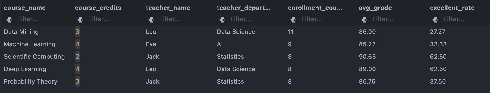

【出题人点评/验收结论】：综合题完成度高，聚合指标设计准确，查询结果符合题目要求。

## 三、思考题

### 问题1

**在编写或检查对方的复杂查询（如多表连接）时，你遇到最大的逻辑难点是什么？**

在编写和检查复杂查询时，最大的逻辑难点是**准确理解表之间的关联关系，以及避免因连接方式不当导致结果重复或遗漏**。例如在多表连接中，需要先明确每张表的主键与外键关系，再判断应使用什么连接方式（以第6题查询学生、课程与教师信息为例，需要正确连接 `students → enrollments → courses → teachers` 的路径）。        

如果连接条件写错，可能产生笛卡尔积，导致结果数量异常增多（以第10题教师课程平均成绩统计为例，若教师表与课程表未按 `teacher_id` 连接，会导致成绩被重复计算）。如果忽略边界情况（如没有选课记录的学生、无人选修的课程），则可能遗漏需要查询的数据（以第8题查询未选课学生为例，需要使用 `NOT EXISTS` 或 `LEFT JOIN` 才能正确保留无关联记录）。      

此外，在聚合查询中还需要特别注意“统计口径”的问题。例如统计学生人数时，如果直接使用 `COUNT(*)`，可能会因为一个学生选修多门课程而被重复计算，因此需要根据实际需求使用 `COUNT(DISTINCT ...)`（以第7题按专业统计学生人数和平均成绩为例，需要避免同一学生因多门选课被重复计入人数）。        

因此，在本次作业中，我总结了以下经验：        

1. **读题时先拆解需求层次**：先明确整体逻辑（业务要查询什么结果），再识别边界条件（是否包含空值、无关联记录、重复记录），最后关注额外限制（如保留两位小数、升序或降序排列、结果条数限制等）。这样可以避免只关注语法而忽略题意细节。

2. **借助 E-R 图和表关系定位连接路径**：在设计数据库时已经明确了各表之间的主键和外键关系，因此写查询时可以快速判断应经过哪些中间表连接。例如学生与课程并非直接关联，而是通过 `enrollments` 表建立多对多关系。

3. **主动补充题目未说明的细节限制**：部分题目只规定主要排序条件，但若出现并列情况，结果顺序可能不稳定。此时可以增加次级排序条件（如按姓名首字母升序、按课程编号升序），提升查询结果的稳定性和准确性（例如第6题在按课程学分和成绩排序后，可再按学生姓名升序排列）。

### 问题2
**如果要在表中删除一条记录，但该记录在其他表中有外键关联，数据库会作何反应？如何处理或规避这种冲突？**

在关系型数据库中，如果删除的记录仍被其他表通过外键引用，数据库通常会拒绝删除操作，并提示外键约束错误。这是数据库为了保证数据一致性而提供的保护机制，防止出现孤立记录。例如，在本次作业设计的选课系统中，如果某个学生在 enrollments 表中仍存在选课记录，直接删除 students 表中的该学生，系统会报错并阻止删除。     

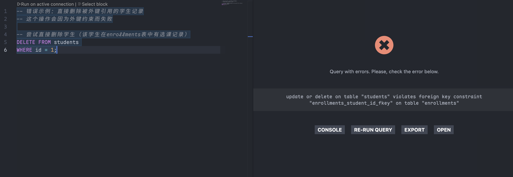

在本次数据库作业中，更适合采用“先删除子表记录，再删除主表记录”的方式进行物理删除。这种方式能够直观体现外键约束的作用，帮助理解数据之间的依赖关系以及数据库如何保证数据一致性。    

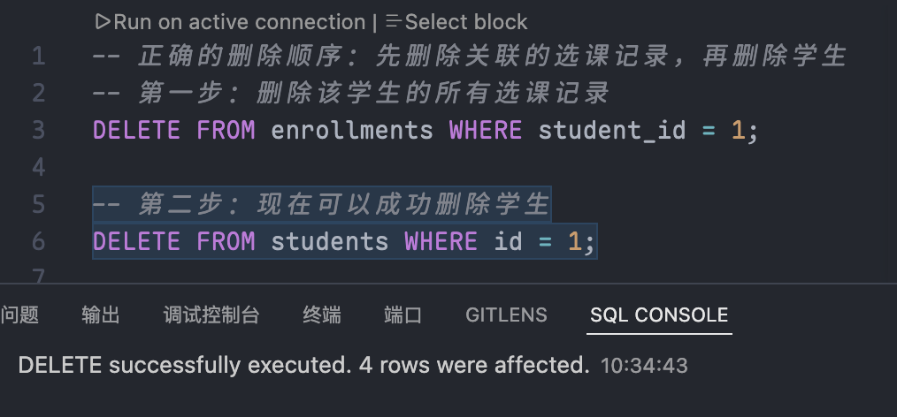

经过查询资料得知，在实际工程中最常用的是逻辑删除，即在系统中保留数据，通过增加标记字段（如 is_deleted）来表示数据被删除。这种方式可以避免数据丢失，支持数据恢复，满足审计、溯源和查询历史记录的需求，因此在真实业务系统中更为常见。但是，这种方式需要在应用层进行额外的处理，以确保数据的安全性、一致性和完整性。并且，相比级联的物理删除，逻辑删除虽然更接近实际工程，但会弱化外键约束机制的体现，因此不作为本次实验的主要方案。

## 四、其他说明

### 关于llm的使用
使用llm的部分如下：
1. 撰写完建表语句`schema.sql`后，使用LLM辅助生成了测试数据（`data.sql`），以模拟真实业务场景。
2. 在互评代码之前，通过询问llm了解sql代码的code review 原则，在撰写评价时参考了其建议（所给出的principle已经附在该部分报告开头）。
3. 撰写思考题2时，使用llm辅助了解了实际业务场景中逻辑删除的概念和实现方式。